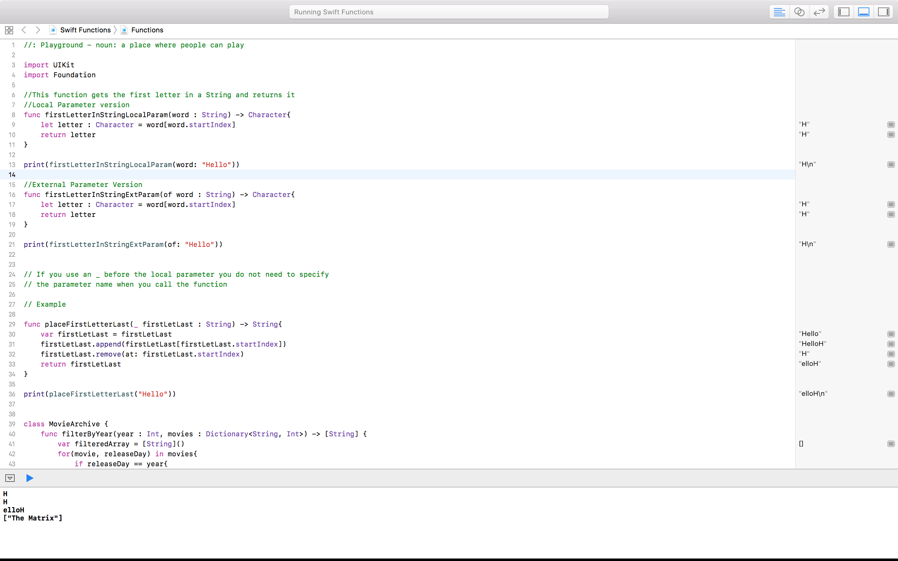
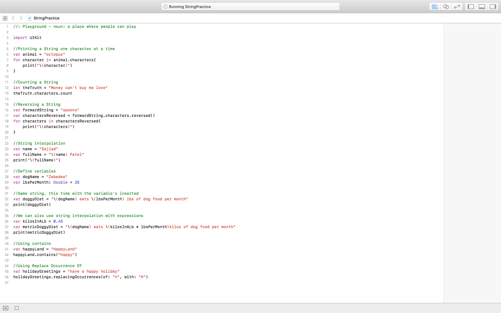

# SRGReadme
This repository has reference code for swift

## Functions

## Strings

## SETUP / USAGE / HOW TO
To use this code make sure you are running on Macintosh and have XCode running on  
your computer

## Contact Information
If you are having any trouble downloading or running the playground files please  
email me at sajjadp92@outlook.com

## Contributors
thelegion92 (sajjadp92@outlook.com)
